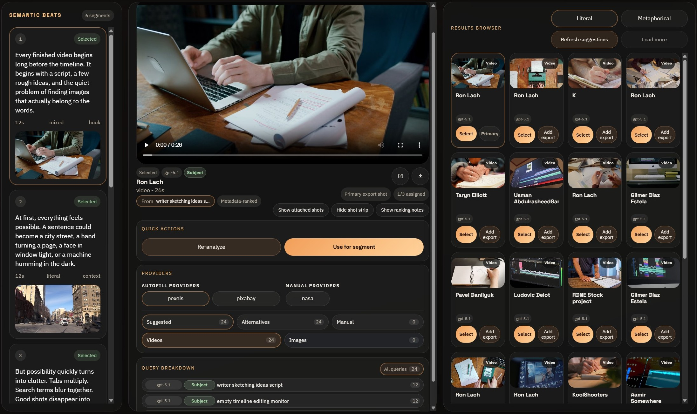

# Glowstone B-Roll Alpha

Glowstone B-Roll Alpha turns a script into semantic beats, visual research, and an editor handoff.

It is a free Windows desktop Alpha for creators and researchers. The workflow is:

`paste your script → app turns it into semantic beats → visual research → timeline handoff into Adobe Premier or DaVinci Resolve`

This repository is a public release and discovery hub. It contains documentation, release notes, and issue intake only. The application source code is private and is not included here.

Additional captures:

- [Shot strip and query breakdown](assets/screenshots/Screenshot_2.jpg)
- [Project setup and preview](assets/screenshots/Screenshot_3.jpg)

## Alpha status

Glowstone B-Roll Alpha is a pre-release application intended for careful real use and feedback.

The app helps you plan and find b-roll footage, research visuals. It is not a video editor. You review the suggested assets, queries, and media yourself, then finish the project in your editor.

## Current provider boundary

### Asset and stock providers

- **Pexels** supports generated searches and automatic fill. You provide your own Pexels API key.
- **Pixabay** supports generated searches and automatic fill. You provide your own Pixabay API key.
- **NASA** is a manual, search-first source for images and videos. It does not require an API key and is not used by default automatic fill.

### AI and model providers

- **Ollama** connects to a model server running locally on your computer.
- **LM Studio** connects to a local OpenAI-compatible model server.
- **OpenRouter** is a hosted model provider. You provide your own API key; your script and segment text are sent to OpenRouter when you analyze with it.

## Downloads

- Installer: **PLACEHOLDER — add the stable latest-release Setup EXE link**
- Portable: **PLACEHOLDER — add the stable latest-release Portable EXE link**

## Typical workflow

1. Create a project and paste in your script.
2. Analyze it with a local model or OpenRouter.
3. Review the semantic beats and literal or metaphorical query suggestions.
4. Browse Pexels or Pixabay, or search NASA manually.
5. Select and review shots for each beat.
6. Export a CSV, JSON file, or handoff package.
7. Continue the edit in Resolve, Premiere, or another editor.

## Alpha limitations

- This is a planning, search, and export tool, not a video editor.
- Limited pull of available providers.

## Documentation

- [Getting started](docs/getting-started.md)
- [Providers and API keys](docs/providers-and-api-keys.md)
- [Export workflow](docs/export-workflow.md)
- [Troubleshooting](docs/troubleshooting.md)
- [Privacy](docs/privacy.md)
- [Support](SUPPORT.md)
- [Security](SECURITY.md)
- [Changelog](CHANGELOG.md)

## Feedback and help

- Feedback: [GitHub Issues](https://github.com/feelalright-dev/glowstone-b-roll-alpha/issues/new/choose)
- Help and support: [support@feelalright.dev](mailto:support@feelalright.dev)

For a reproducible bug, use the [bug-report template](.github/ISSUE_TEMPLATE/bug_report.md) once GitHub Issues are enabled. Do not include API keys, private scripts, or other sensitive material.

## License

`LICENSE.txt` contains the proprietary freeware notice for the Glowstone B-Roll Alpha application and its distribution packages. No source code or redistribution right is granted by this documentation hub.
